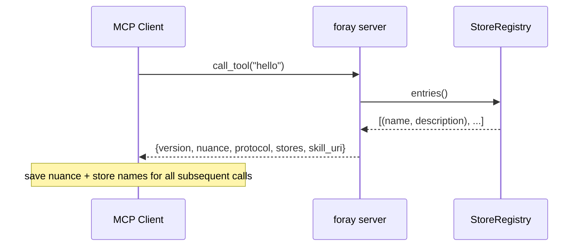
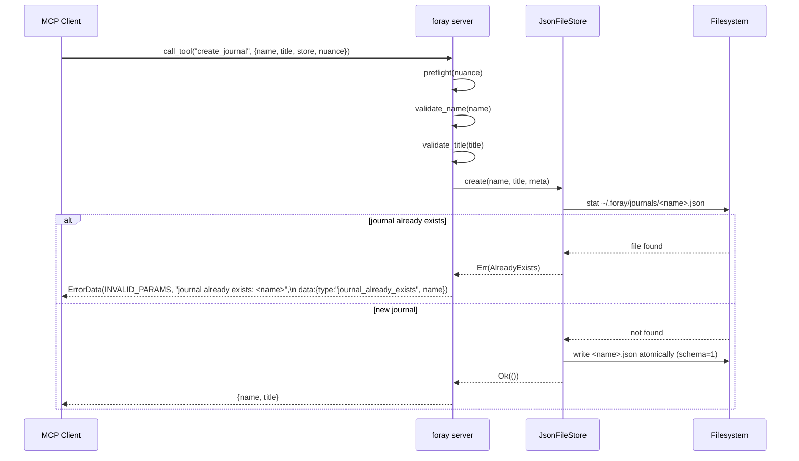
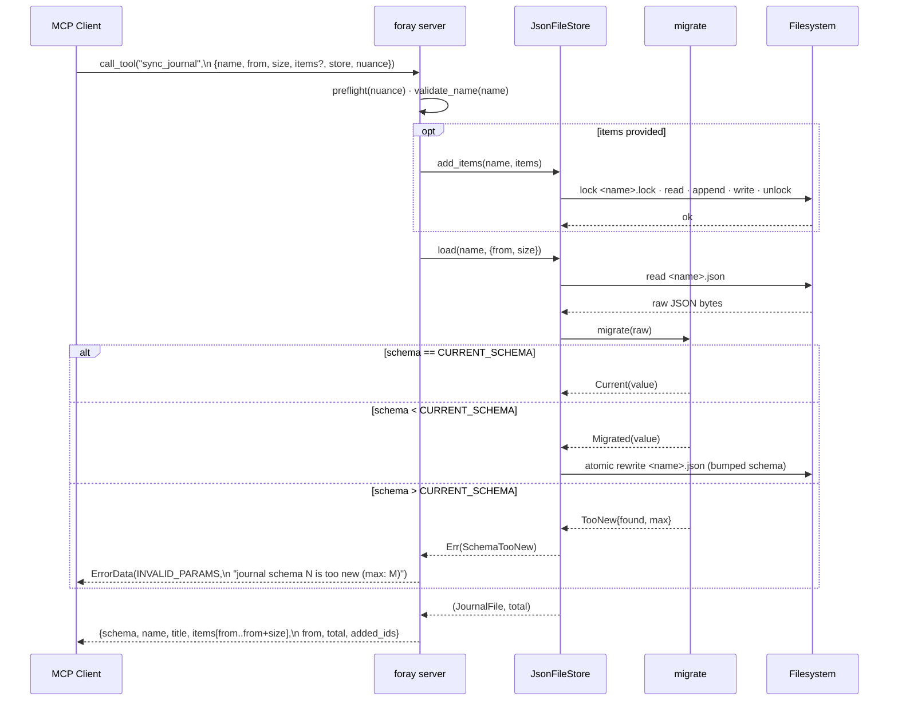
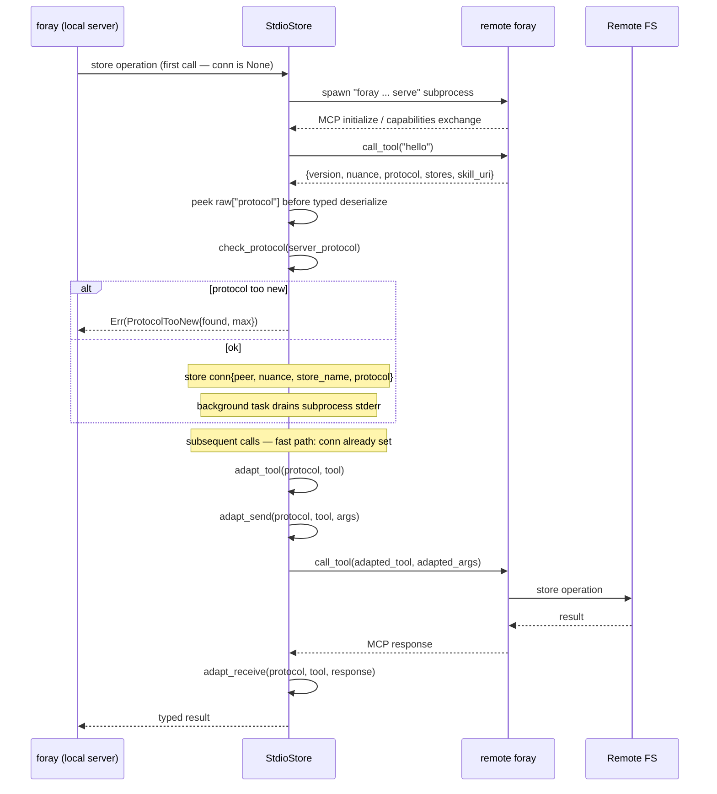
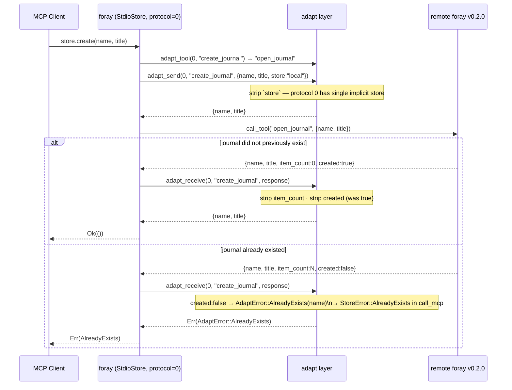
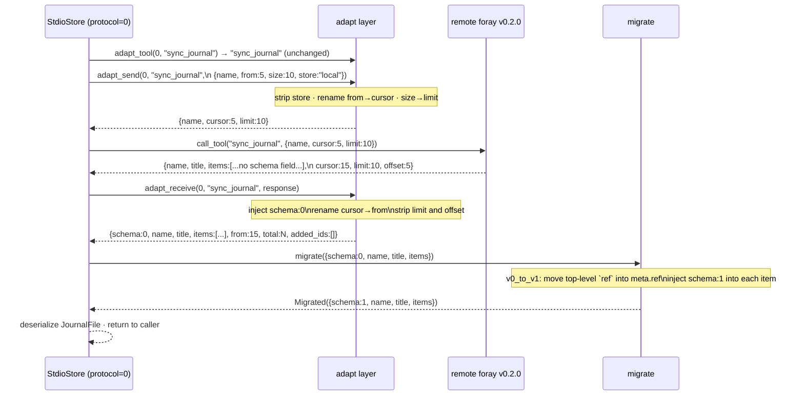

# foray — Sequence Diagrams

Key runtime flows. Diagrams use Mermaid and render on GitHub.

---

## 1. Session Bootstrap (`hello`)

Every session starts with `hello`. The client gets back the session-scoped `nuance`
token (replay-protection), the wire protocol version, and the list of available stores.
All subsequent tool calls must include the `nuance` and a `store` from this list.

---

## 2. `create_journal` — Local Store (Happy Path & Duplicate)

`create_journal` is strict create-only — it returns `AlreadyExists` if the journal
is already present rather than silently reopening it. This makes "create" and "open"
distinct intents, preventing accidental clobbers.

---

## 3. `sync_journal` — Read + Write, Local Store

`sync_journal` is the workhorse: optionally append items, then return the requested
page. Writes and reads happen in the same call so callers always see their own items.
`migrate()` runs on every read — schema upgrades are transparent and trigger an
atomic file rewrite.

---

## 4. StdioStore — Lazy Connect & Protocol Negotiation

`StdioStore` connects lazily on the first call and reuses the connection for all
subsequent ones. The `hello` handshake discovers the server's protocol version;
`check_protocol` gates any future calls. Old servers (protocol 0) get transparent
adaptation on every call.

---

## 5. Protocol 0 Compatibility — `create_journal` → `open_journal`

Protocol 0 servers (foray v0.2.0) expose `open_journal` (upsert semantics) instead
of `create_journal` (strict create). The adapt layer rewrites the tool name, strips
unknown params, and maps the v0 `created: false` field to `AlreadyExists` so callers
see consistent semantics regardless of the server version they are talking to.

---

## 6. Schema Migration on Wire — `sync_journal` from Protocol 0 Server

When `StdioStore` talks to a protocol 0 server (foray v0.2.0), items in the
`sync_journal` response may be at schema 0 (no `schema` field, `ref` at top level).
`adapt_receive` injects `schema:0` so `migrate()` can normalise them to schema 1
before deserialization — completely transparent to the caller.

